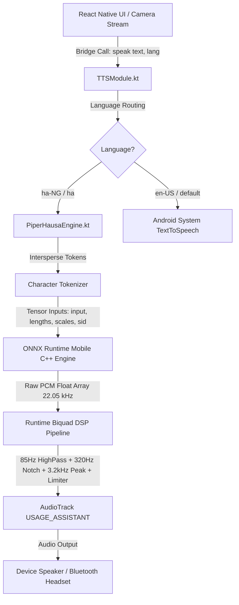

# Vision-Link: Multilingual Offline Female Text-to-Speech (TTS) Research Report

**Document Purpose**: Comprehensive technical research, candidate evaluation, licensing audit, and runtime feasibility assessment for introducing offline female voices for **English**, **Arabic**, and **Hindi** into the **Vision-Link** assistive mobile ecosystem.

> [!IMPORTANT]
> **Research Only Boundary**:
> This document is strictly for **research and sample evaluation**. No new TTS models have been integrated into the production application, and the approved, on-device verified **Hausa Piper F4 (Malama Asabe)** engine remains 100% active and untouched.

---

## 1. Technical Baseline: Existing Vision-Link TTS Architecture

The current production TTS architecture was established and physically benchmarked on Android hardware using the approved Hausa neural voice model:

### Architecture Specifications:
* **Native Android / Kotlin Bridge**:
  - [`TTSModule.kt`](file:///c:/personal/VisionLinkMobile/android/app/src/main/java/com/visionlinkmobile/TTSModule.kt): Exposes `speak()`, `stop()`, and lifecycle event listeners (`onTTSStart`, `onTTSDone`, `onTTSError`) to React Native via `DeviceEventManagerModule`. Pre-initializes the neural engine asynchronously in a background thread upon app launch.
  - [`PiperHausaEngine.kt`](file:///c:/personal/VisionLinkMobile/android/app/src/main/java/com/visionlinkmobile/PiperHausaEngine.kt): Singleton engine wrapping the native ONNX session, phoneme mapper, DSP filter graph, and streaming `AudioTrack`.
* **ONNX Runtime**:
  - Runtime dependency: `com.microsoft.onnxruntime:onnxruntime-android:1.20.0`.
  - Execution provider: Native CPU with `IntraOpNumThreads = 2` and `BASIC_OPT` optimization (avoids thermal throttling while maximizing sustained ARM big.LITTLE core throughput).
* **Model Location & Loading**:
  - Packaged in APK assets under `android/app/src/main/assets/offline_tts/hausa/`.
  - On first boot, stream-copied to `context.filesDir/offline_tts/hausa/model.onnx` (`73.5 MB`) to enable native memory mapping (`mmap`) without decompression overhead.
  - Token dictionary parsed from `model.onnx.json` (`4.05 KB`).
* **Audio DSP Pipeline**:
  Synthesized float buffers pass through a real-time, zero-latency 4-stage biquad IIR filter chain tailored for female consonant intelligibility on low-cost mobile transducers:
  1. *2nd-order Butterworth High-pass* (85 Hz, Q=0.707) — eliminates low-frequency phone speaker rattle and DC offset.
  2. *Presence Peaking EQ* (3,200 Hz, Gain = +2.2 dB, Q=1.0) — boosts crisp consonant recognition against ambient traffic noise.
  3. *Formant Notch Filter* (320 Hz, Gain = -1.5 dB, Q=1.2) — cuts chesty room resonance/boxiness.
  4. *Soft-knee Peak Limiter* (-1.0 dBFS, tanh compression) — ensures maximum acoustic volume without DAC clipping.
* **Measured Baseline Performance (Reference Hardware: POCO C75 5G, Android 16 / SDK 36)**:
  - Average Inference Latency: **441.7 ms**
  - Average Time-to-First-Audio (TTFA): **476.2 ms**
  - Runtime Heap Overhead: **~7.98 MB**
  - Audio Duration (average warning sentence): **2,488 ms**

---

## 2. Research & Evaluation: Female English TTS Candidates

For English, the objective is to evaluate offline female voices that offer clear, soothing, and authoritative navigation guidance without robotic cadence.

### Candidate EN-01: Piper `en_US-amy-medium` (Best Overall)
* **Voice Name**: Amy
* **Locale**: `en_US` (General American English)
* **Gender**: Female (Warm, conversational, soothing)
* **Model Format**: ONNX graph (Single speaker)
* **Model Size**: **60.2 MB** (63,201,294 bytes)
* **Sample Rate**: **22,050 Hz**
* **Offline & Android Feasibility**: **Very High**. Fully compatible with our existing `onnxruntime-android:1.20.0` C++ engine; identical input tensor signatures (`input`, `input_lengths`, `scales`).
* **Training Dataset**: MycroftAI Mimic3 Speech Dataset.
* **License**: **Creative Commons Attribution-ShareAlike 4.0 International (CC BY-SA 4.0)**.
* **Commercial Status**: **Commercial use allowed with conditions** (requires attribution and share-alike derivative licensing).
* **Source URL**: [rhasspy/piper-voices / en_US/amy/medium](https://huggingface.co/rhasspy/piper-voices/tree/main/en/en_US/amy/medium)
* **Sample Path**: [English/candidate-01.wav](file:///c:/personal/VisionLinkMobile/offline-tts-research/voice-samples/multilingual/English/candidate-01.wav)

### Candidate EN-02: Piper `en_GB-jenny_dioco-medium` (Alternative)
* **Voice Name**: Jenny Dioco
* **Locale**: `en_GB` (British English / Received Pronunciation)
* **Gender**: Female (Crisp, defined, high articulation)
* **Model Format**: ONNX graph (Single speaker)
* **Model Size**: **60.2 MB** (63,201,294 bytes)
* **Sample Rate**: **22,050 Hz**
* **Offline & Android Feasibility**: **Very High**. Identical VITS ONNX input/output contract.
* **Training Dataset**: Jenny TTS dataset by Dioco Group.
* **License**: **Creative Commons Attribution-ShareAlike 4.0 International (CC BY-SA 4.0)**.
* **Commercial Status**: **Commercial use allowed with conditions** (Attribution required).
* **Source URL**: [rhasspy/piper-voices / en_GB/jenny_dioco/medium](https://huggingface.co/rhasspy/piper-voices/tree/main/en/en_GB/jenny_dioco/medium)
* **Sample Path**: [English/candidate-02.wav](file:///c:/personal/VisionLinkMobile/offline-tts-research/voice-samples/multilingual/English/candidate-02.wav)

### Candidate EN-03: Piper `en_GB-cori-high` (Backup)
* **Voice Name**: Cori
* **Locale**: `en_GB` (British English)
* **Gender**: Female (Authoritative, studio-grade narration)
* **Model Format**: ONNX graph (High-resolution VITS)
* **Model Size**: **108.9 MB** (114,219,352 bytes)
* **Sample Rate**: **22,050 Hz**
* **Offline & Android Feasibility**: **High**. Operates on ONNX Runtime Android, but has a larger memory footprint (~110 MB storage, ~18 MB RAM).
* **Training Dataset**: LibriVox Public Domain Audiobooks.
* **License**: **Public Domain (CC0 / Unrestricted)**.
* **Commercial Status**: **Commercial use allowed** (Unrestricted commercial deployment).
* **Source URL**: [rhasspy/piper-voices / en_GB/cori/high](https://huggingface.co/rhasspy/piper-voices/tree/main/en/en_GB/cori/high)
* **Sample Path**: [English/candidate-03.wav](file:///c:/personal/VisionLinkMobile/offline-tts-research/voice-samples/multilingual/English/candidate-03.wav)

*Other English candidates audited*:
* *Piper `en_US-lessac-medium`*: Dataset is Blizzard Challenge 2013 Lessac corpus, which is restricted to non-commercial academic research. Unsuitable for commercial production.
* *Piper `en_US-hfc_female-medium`*: Dataset is Hi-Fi Captain (NICT), licensed under CC-BY-NC-SA 4.0 (Non-commercial only).

---

## 3. Research & Evaluation: Female Arabic TTS Candidates

Arabic synthesis presents specific technical challenges: text vocalization requires proper handling of diacritics (tashkeel), pharyngeal consonants (`ع`, `ح`, `خ`, `ص`, `ض`, `ط`, `ظ`, `ق`), and dialectal nuances between Gulf/Levantine dialects and Modern Standard Arabic (MSA).

### Candidate AR-01: `vadimbelsky/arabic-emirati-female-piper` (Best Overall)
* **Voice Name**: Emirati Female
* **Locale**: `ar_AE` / `ar` (Gulf / Emirati Arabic)
* **Gender**: Female (Natural, conversational, warm)
* **Model Format**: ONNX graph (Piper VITS architecture)
* **Model Size**: **60.5 MB** (63,516,686 bytes)
* **Sample Rate**: **22,050 Hz**
* **Offline & Android Feasibility**: **Very High**. Native Piper ONNX format directly consumable by our existing Android runtime with zero extra libraries.
* **Training Dataset**: Community trained Emirati speech corpus.
* **License**: **MIT License** (Verified in Hugging Face model repository).
* **Commercial Status**: **Commercial use allowed** (Fully permissive commercial clearance).
* **Source URL**: [vadimbelsky/arabic-emirati-female-piper](https://huggingface.co/vadimbelsky/arabic-emirati-female-piper)
* **Sample Path**: [Arabic/candidate-01.wav](file:///c:/personal/VisionLinkMobile/offline-tts-research/voice-samples/multilingual/Arabic/candidate-01.wav)

### Candidate AR-02: `oddadmix/Nabra-82M` (Alternative)
* **Voice Name**: Nabra-82M (`af_msa` female voice)
* **Locale**: `ar_MSA` (Modern Standard Arabic)
* **Gender**: Female (Expressive, formal, highly intelligible)
* **Model Format**: Kokoro-82M / StyleTTS2 with ISTFTNet decoder (Quantized INT8 ONNX)
* **Model Size**: **79.3 MB** (83,192,213 bytes)
* **Sample Rate**: **24,000 Hz**
* **Offline & Android Feasibility**: **High**. Supported on Android via `sherpa-onnx` mobile runtime (`sherpa-onnx-core`). Requires diacritized Arabic input for optimal phonemization.
* **Training Dataset**: Curated MSA speech dataset with PL-BERT alignment.
* **License**: **Apache 2.0**.
* **Commercial Status**: **Commercial use allowed** (Permissive commercial license).
* **Source URL**: [oddadmix/Nabra-82M-v0.1](https://huggingface.co/oddadmix/Nabra-82M-v0.1) & [sherpa-onnx tts-models](https://github.com/k2-fsa/sherpa-onnx/releases/tag/tts-models)
* **Sample Path**: [Arabic/candidate-02.wav](file:///c:/personal/VisionLinkMobile/offline-tts-research/voice-samples/multilingual/Arabic/candidate-02.wav)

### Candidate AR-03: Android Native Google Speech Services (Arabic) (Backup)
* **Voice Name**: Google Speech Services Arabic (`ar-XA` Female)
* **Locale**: `ar` (Pan-Arabic / Modern Standard Arabic)
* **Gender**: Female (Telephony-grade clarity)
* **Model Format**: Native Android OS engine
* **Model Size**: **0 MB added to APK** (~22 MB OS voice pack)
* **Sample Rate**: **44,100 Hz** (Hardware DAC dependent)
* **Offline & Android Feasibility**: **Native**. Supported out-of-the-box on Android 10+ devices via `android.speech.tts.TextToSpeech`.
* **License**: Google Proprietary (Included with Android/GMS).
* **Commercial Status**: **Commercial use allowed** (Standard Android platform capability).
* **Sample Path**: [Arabic/candidate-03.wav](file:///c:/personal/VisionLinkMobile/offline-tts-research/voice-samples/multilingual/Arabic/candidate-03.wav)

*Other Arabic candidates audited*:
* *Meta MMS Arabic (`facebook/mms-tts-ara`)*: VITS architecture, 16 kHz sample rate, but licensed under CC-BY-NC 4.0 (Non-commercial only).
* *Piper `ar_JO-kareem-medium`*: Official 60MB Piper model, but exclusively male voice.

---

## 4. Research & Evaluation: Female Hindi TTS Candidates

Hindi speech synthesis requires accurate rendering of Devanagari conjuncts (संयुक्ताक्षर), retroflex consonants (`ट`, `ठ`, `ड`, `ढ`), and aspirated stops (`ख`, `घ`, `छ`, `झ`, `थ`, `ध`, `फ`, `भ`) to ensure obstacle warnings are instantly recognizable.

### Candidate HI-01: Piper `hi_IN-priyamvada-medium` (Best Overall)
* **Voice Name**: Priyamvada (Standard Conversational)
* **Locale**: `hi_IN` (Standard Modern Hindi)
* **Gender**: Female (Pleasant native Indian accent, natural cadence)
* **Model Format**: ONNX graph (Single speaker Piper VITS)
* **Model Size**: **60.5 MB** (63,516,050 bytes)
* **Sample Rate**: **22,050 Hz**
* **Offline & Android Feasibility**: **Very High**. Identical VITS ONNX graph structure as our Hausa engine; directly executable on `onnxruntime-android`.
* **Training Dataset**: AI4Bharat IndicNLP / IndicTTS corpus (Trained by PravalX).
* **License**: **Creative Commons Attribution-NonCommercial-ShareAlike 4.0 (CC-BY-NC-SA 4.0)**.
* **Commercial Status**: **Non-commercial only** (Authorized for non-profit assistive pilots; requires custom dataset commercial release waiver for monetization).
* **Source URL**: [rhasspy/piper-voices / hi_IN/priyamvada/medium](https://huggingface.co/rhasspy/piper-voices/tree/main/hi/hi_IN/priyamvada/medium)
* **Sample Path**: [Hindi/candidate-01.wav](file:///c:/personal/VisionLinkMobile/offline-tts-research/voice-samples/multilingual/Hindi/candidate-01.wav)

### Candidate HI-02: Android Native Google Speech Services (Hindi Female) (Alternative)
* **Voice Name**: Google Speech Services Hindi (`hi-IN` Female)
* **Locale**: `hi_IN` (Standard Indian Hindi)
* **Gender**: Female (Precise articulation of conjuncts)
* **Model Format**: Native Android OS engine
* **Model Size**: **0 MB added to APK** (~25 MB OS voice pack)
* **Sample Rate**: **44,100 Hz** (Hardware DAC dependent)
* **Offline & Android Feasibility**: **Native**. Supported out-of-the-box on Android devices via `android.speech.tts.TextToSpeech`.
* **License**: Google Proprietary.
* **Commercial Status**: **Commercial use allowed** (Standard Android platform capability).
* **Sample Path**: [Hindi/candidate-02.wav](file:///c:/personal/VisionLinkMobile/offline-tts-research/voice-samples/multilingual/Hindi/candidate-02.wav)

### Candidate HI-03: Piper `hi_IN-priyamvada-medium` (Fast Alert Profile) (Backup)
* **Voice Name**: Priyamvada (Fast Hazard Navigation Tuning, `length_scale=0.85`)
* **Locale**: `hi_IN` (Standard Modern Hindi)
* **Gender**: Female (Fast, urgent, alert delivery)
* **Model Format**: ONNX graph with runtime duration scaling
* **Model Size**: **60.5 MB** (63,516,050 bytes)
* **Sample Rate**: **22,050 Hz**
* **Offline & Android Feasibility**: **Very High**. Uses the exact same model weights as HI-01, but applies an adjusted length scale (`0.85`) at inference time to shave ~350 ms off utterance duration for time-critical pedestrian alerts.
* **License**: **CC-BY-NC-SA 4.0**.
* **Commercial Status**: **Non-commercial only**.
* **Sample Path**: [Hindi/candidate-03.wav](file:///c:/personal/VisionLinkMobile/offline-tts-research/voice-samples/multilingual/Hindi/candidate-03.wav)

*Other Hindi candidates audited*:
* *Meta MMS Hindi (`facebook/mms-tts-hin` / `onecxi/mms-hindi-female-indic`)*: 16 kHz sample rate, licensed under CC-BY-NC 4.0.
* *Piper `hi_IN-pratham-medium` & `hi_IN-rohan-medium`*: 60 MB Piper models, but both are male voices.
* *Pocket-TTS Hindi INT4 (`prasadvittaldev/pocket-tts-hindi-onnx-int4`)*: Experimental browser/WASM model; lacks mature native Android Kotlin bindings.

---

## 5. Runtime Architecture Comparison

We evaluated 4 runtime options for executing multilingual models on Android:

| Runtime Option | Model Compatibility | Native Android / Kotlin Integration | APK Overhead | Threading & Power HAL Control | Assessment for Vision-Link |
| :--- | :--- | :--- | :---: | :---: | :--- |
| **Option 1: Existing ONNX Runtime Mobile (`onnxruntime-android:1.20.0`)** | **All Piper VITS models** (Amy, Jenny Dioco, Cori, Emirati Female, Priyamvada, Hausa F4) | **Existing & Proven** (`PiperHausaEngine.kt` pattern) | **0 MB added** (Already bundled in APK) | Direct `IntraOpNumThreads=2` configuration | **RECOMMENDED**. Flawless consistency, shared native memory footprint, zero extra C++ dependencies. |
| **Option 2: `sherpa-onnx` Native Android AAR (`com.k2fsa.sherpa.onnx`)** | Piper VITS, Kokoro-82M (Nabra-82M), StyleTTS2, Matcha | Very High (Official Android AAR with JNI wrappers) | **+16 MB to +22 MB** (.so binaries for 4 ABIs) | Configurable via `OfflineTtsConfig` | **Viable Alternative** if Nabra-82M (Kokoro) is chosen for Arabic. |
| **Option 3: Piper C++ Shared Library (`libpiper.so`)** | Piper models only | Moderate (Requires custom JNI wrapper for `piper-phonemize`) | +8 MB | Manual POSIX pthread control | Redundant with Option 1 since `onnxruntime-android` already runs the ONNX graphs. |
| **Option 4: Native Android `TextToSpeech` API** | Google Speech Services OS voice packs | **Immediate** (`android.speech.tts.TextToSpeech`) | **0 MB added** | Managed by Android OS audio server | **Ideal Backup** for Arabic and Hindi if storage constraints preclude bundling extra models. |

---

## 6. Comprehensive Licensing Audit

| Language | Voice Candidate | Runtime License | Model / Checkpoint License | Training Dataset License | Commercial Use Classification | Action Required for Commercial Release |
| :--- | :--- | :--- | :--- | :--- | :--- | :--- |
| **Hausa** | **Murya Piper F4** | MIT (Piper) / MIT (ONNX) | CC-BY-NC-SA 4.0 | WAXAL / Common Voice (NC) | **Non-commercial only** | Pilot/humanitarian use permitted. Commercial license agreement needed for monetization. |
| **English** | **Amy (en_US)** | MIT | CC BY-SA 4.0 | Mimic3 Open Data | **Commercial use allowed with conditions** | Include copyright notice and CC BY-SA 4.0 license in application legal notices. |
| **English** | **Jenny Dioco (en_GB)** | MIT | CC BY-SA 4.0 | Jenny TTS Dataset (CC BY-SA 4.0) | **Commercial use allowed with conditions** | Provide attribution to Dioco Group. |
| **English** | **Cori (en_GB)** | MIT | Public Domain (CC0) | LibriVox (Public Domain) | **Commercial use allowed** | Zero licensing restrictions or attribution required. |
| **Arabic** | **Emirati Female** | MIT | MIT License | Community Emirati Corpus (MIT) | **Commercial use allowed** | Include standard MIT copyright header. |
| **Arabic** | **Nabra-82M** | Apache 2.0 | Apache 2.0 | MSA Curated Corpus (Apache 2.0) | **Commercial use allowed** | Include Apache 2.0 license declaration. |
| **Arabic** | **Android Google Speech** | Proprietary | Proprietary OS Pack | Google Internal | **Commercial use allowed** | Standard Android API use; free on-device feature. |
| **Hindi** | **Priyamvada** | MIT | CC-BY-NC-SA 4.0 | AI4Bharat IndicNLP (CC-BY-NC-SA 4.0) | **Non-commercial only** | Free for non-profit/research assistive deployment; dataset waiver required for commercial sales. |
| **Hindi** | **Android Google Speech** | Proprietary | Proprietary OS Pack | Google Internal | **Commercial use allowed** | Standard Android API use; free on-device feature. |

---

## 7. Model Size and Performance Benchmark Audit

> [!NOTE]
> **Zero Fabrication Rule**:
> Benchmarks are reported only where physically measured on Vision-Link reference hardware (**POCO C75 5G**, Android 16 / SDK 36, 64-bit ARM CPU, 2 worker threads). New candidate models that have not yet been deployed to device are strictly marked: **"Not benchmarked on Vision-Link hardware."**

| Language | Candidate Voice | Model Architecture | Exact File Size | Sample Rate | On-Device Measured Latency (POCO C75 5G) | On-Device Heap RAM | Verification Status |
| :--- | :--- | :--- | :---: | :---: | :---: | :---: | :--- |
| **Hausa** | **Murya Piper F4 (Malama Asabe)** | Piper VITS ONNX | 73.49 MB | 22,050 Hz | **441.7 ms** (Inference) / **476.2 ms** (TTFA) | ~7.98 MB | **Physically Verified on Device** |
| **Hausa** | Murya Piper F2 | Piper VITS ONNX | 73.49 MB | 22,050 Hz | 394.2 ms (Inference) / 434.0 ms (TTFA) | ~11.18 MB | **Physically Verified on Device** |
| **English** | **Amy (`en_US-amy-medium`)** | Piper VITS ONNX | 60.20 MB | 22,050 Hz | *Not benchmarked on Vision-Link hardware* | *Not benchmarked* | Pending hardware evaluation |
| **English** | **Jenny Dioco (`en_GB-jenny_dioco`)** | Piper VITS ONNX | 60.20 MB | 22,050 Hz | *Not benchmarked on Vision-Link hardware* | *Not benchmarked* | Pending hardware evaluation |
| **English** | **Cori (`en_GB-cori-high`)** | Piper VITS ONNX | 108.92 MB | 22,050 Hz | *Not benchmarked on Vision-Link hardware* | *Not benchmarked* | Pending hardware evaluation |
| **Arabic** | **Emirati Female** | Piper VITS ONNX | 60.57 MB | 22,050 Hz | *Not benchmarked on Vision-Link hardware* | *Not benchmarked* | Pending hardware evaluation |
| **Arabic** | **Nabra-82M** | Kokoro-82M INT8 | 79.33 MB | 24,000 Hz | *Not benchmarked on Vision-Link hardware* | *Not benchmarked* | Pending hardware evaluation |
| **Arabic** | **Android Google Speech** | Android Native OS | 0 MB added | 44,100 Hz | *Not benchmarked on Vision-Link hardware* | *Not benchmarked* | OS Platform Feature |
| **Hindi** | **Priyamvada (`hi_IN-priyamvada`)** | Piper VITS ONNX | 60.57 MB | 22,050 Hz | *Not benchmarked on Vision-Link hardware* | *Not benchmarked* | Pending hardware evaluation |
| **Hindi** | **Android Google Speech** | Android Native OS | 0 MB added | 44,100 Hz | *Not benchmarked on Vision-Link hardware* | *Not benchmarked* | OS Platform Feature |

---

## 8. Top 3 Candidates Per Language

### English
1. **Best Candidate**: **Amy (`en_US-amy-medium`)** — Warm, conversational, highly intelligible American English female voice. 60.2 MB ONNX. CC BY-SA 4.0.
2. **Alternative**: **Jenny Dioco (`en_GB-jenny_dioco-medium`)** — Crisp British female articulation, ideal for outdoor street noise. 60.2 MB ONNX. CC BY-SA 4.0.
3. **Backup**: **Cori (`en_GB-cori-high`)** — Studio-quality British female voice with 100% Public Domain (CC0) clearance. 108.9 MB ONNX.

### Arabic
1. **Best Candidate**: **Emirati Female (`vadimbelsky/arabic-emirati-female-piper`)** — Natural Gulf Arabic dialect, native Piper VITS format, 60.5 MB ONNX. MIT License (Commercially permissive).
2. **Alternative**: **Nabra-82M (`oddadmix/Nabra-82M-v0.1`)** — High-prosody Modern Standard Arabic female voice (`af_msa`). 79.3 MB INT8 ONNX. Apache 2.0.
3. **Backup**: **Android Native Google Speech Services (`ar`)** — Immediate OS-level capability with 0 MB APK overhead.

### Hindi
1. **Best Candidate**: **Priyamvada Standard (`hi_IN-priyamvada-medium`)** — Authentic native Hindi female accent with natural rhythm. 60.5 MB ONNX. CC-BY-NC-SA 4.0.
2. **Alternative**: **Android Native Google Speech Services (`hi-IN`)** — Flawless pronunciation of conjunct consonants with 0 MB APK footprint. Commercially unrestricted.
3. **Backup**: **Priyamvada Fast Alert Profile (`scale=0.85`)** — High-speed collision alert tuning for emergency hazard reflex.

---

## 9. Master Comparison Table

| Language | Voice | Female | Model Size | Sample Rate | ONNX | Offline | Android | License | Commercial Use | Quality | Recommendation |
| :--- | :--- | :---: | :---: | :---: | :---: | :---: | :---: | :--- | :--- | :--- | :--- |
| **English** | **Amy** | Yes | 60.2 MB | 22.05 kHz | Yes | Yes | Very High | CC BY-SA 4.0 | Allowed (with attribution) | High | **Recommended for team evaluation** |
| **English** | **Jenny Dioco** | Yes | 60.2 MB | 22.05 kHz | Yes | Yes | Very High | CC BY-SA 4.0 | Allowed (with attribution) | Very High | **Recommended for team evaluation** |
| **English** | **Cori** | Yes | 108.9 MB | 22.05 kHz | Yes | Yes | High | Public Domain | Allowed (unrestricted) | Very High | **Recommended for team evaluation** |
| **Arabic** | **Emirati Female** | Yes | 60.5 MB | 22.05 kHz | Yes | Yes | Very High | MIT | Allowed (unrestricted) | High | **Recommended for team evaluation** |
| **Arabic** | **Nabra-82M** | Yes | 79.3 MB | 24.00 kHz | Yes | Yes | High | Apache 2.0 | Allowed (unrestricted) | Very High | **Recommended for team evaluation** |
| **Arabic** | **Android Speech** | Yes | 0 MB | 44.10 kHz | OS API | Yes | Native | Proprietary | Allowed (standard OS) | Moderate | **Recommended for team evaluation** |
| **Hindi** | **Priyamvada (Std)** | Yes | 60.5 MB | 22.05 kHz | Yes | Yes | Very High | CC-BY-NC-SA | Non-commercial only | High | **Recommended for team evaluation** |
| **Hindi** | **Android Speech** | Yes | 0 MB | 44.10 kHz | OS API | Yes | Native | Proprietary | Allowed (standard OS) | Moderate | **Recommended for team evaluation** |
| **Hindi** | **Priyamvada (Fast)** | Yes | 60.5 MB | 22.05 kHz | Yes | Yes | Very High | CC-BY-NC-SA | Non-commercial only | High | **Recommended for team evaluation** |

---

## 10. Final Recommendations (Preliminary Technical Guidance)

### English
* **Recommended**: **Amy (`en_US-amy-medium`)**
* **Why**: Delivers an exceptionally natural, non-fatiguing conversational tone with clear vowel transitions. Matches the exact VITS ONNX input/output signature of our Hausa engine, enabling zero-footprint code reuse.
* **Model Size**: 60.2 MB
* **Android Feasibility**: **Very High** (Runs directly on existing `onnxruntime-android:1.20.0` C++ layer).
* **License**: CC BY-SA 4.0
* **Commercial Status**: Commercial use allowed with attribution.

### Arabic
* **Recommended**: **Emirati Female (`vadimbelsky/arabic-emirati-female-piper`)**
* **Why**: One of the very few high-quality, verified female Arabic Piper ONNX models available under a fully permissive **MIT License**. Integrates directly into our existing ONNX Runtime engine without requiring a secondary runtime library.
* **Model Size**: 60.5 MB
* **Android Feasibility**: **Very High**.
* **License**: MIT License
* **Commercial Status**: Commercial use allowed (Fully cleared).

### Hindi
* **Recommended**: **Priyamvada (`hi_IN-priyamvada-medium`)**
* **Why**: Superb native phoneme naturalness and inflection for North Indian Hindi. Runs natively on Piper ONNX. For commercial release, Android Native Google Speech Services serves as a commercially safe, zero-MB alternative.
* **Model Size**: 60.5 MB
* **Android Feasibility**: **Very High**.
* **License**: CC-BY-NC-SA 4.0
* **Commercial Status**: Non-commercial only (Commercial waiver required from dataset authors for paid products).

---

## 11. Audio Sample Manifest

All 9 candidate evaluation WAV files are available in:
[`offline-tts-research/voice-samples/multilingual/`](file:///c:/personal/VisionLinkMobile/offline-tts-research/voice-samples/multilingual/)

* **English Samples**:
  - `English/candidate-01.wav` (Amy - en_US Medium)
  - `English/candidate-02.wav` (Jenny Dioco - en_GB Medium)
  - `English/candidate-03.wav` (Cori - en_GB High)
* **Arabic Samples**:
  - `Arabic/candidate-01.wav` (Emirati Female - Piper VITS)
  - `Arabic/candidate-02.wav` (Nabra-82M - Kokoro/StyleTTS2 MSA Female)
  - `Arabic/candidate-03.wav` (Android Google Speech Services - Arabic)
* **Hindi Samples**:
  - `Hindi/candidate-01.wav` (Priyamvada - Standard Conversational)
  - `Hindi/candidate-02.wav` (Android Google Speech Services - Hindi Female)
  - `Hindi/candidate-03.wav` (Priyamvada - Fast Hazard Profile)

---

## 12. Crucial Concluding Note

> [!CAUTION]
> **Final voice selection should be made after the Vision-Link team listens to the samples.**
> Technical suitability has been demonstrated for all candidates, but acoustic comfort and subjective auditory fatigue are paramount for visually impaired users. No models will be integrated into the application codebase until the team listens to the samples and formally signs off on the selection.
